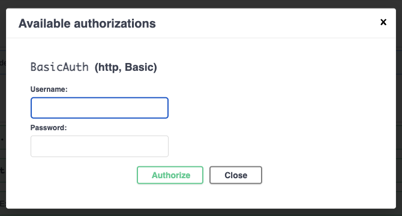
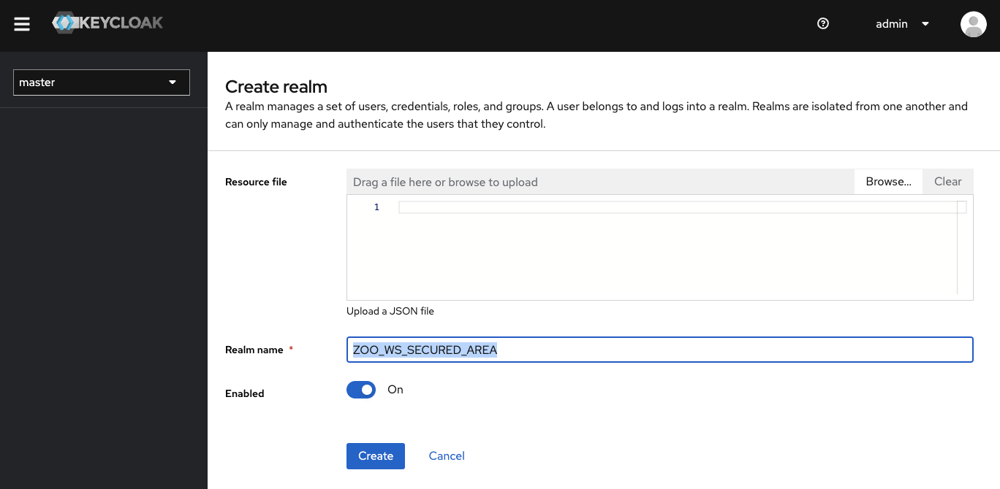
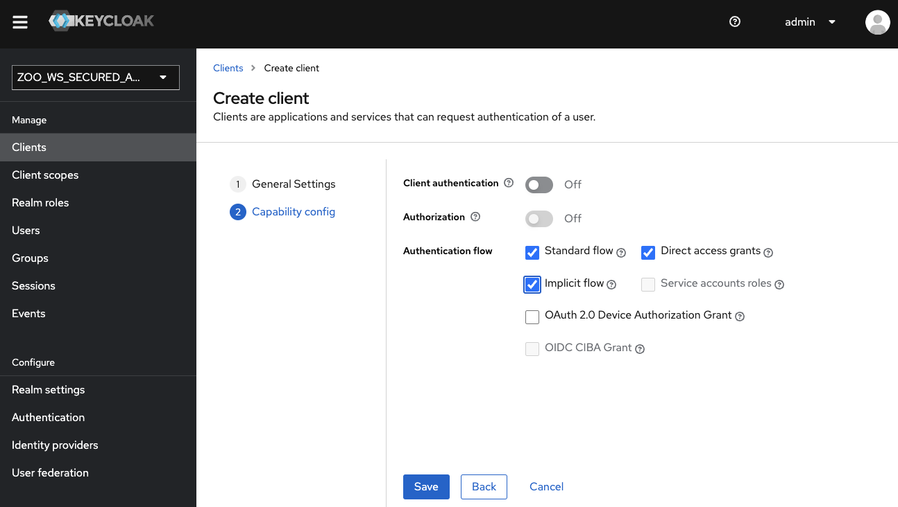
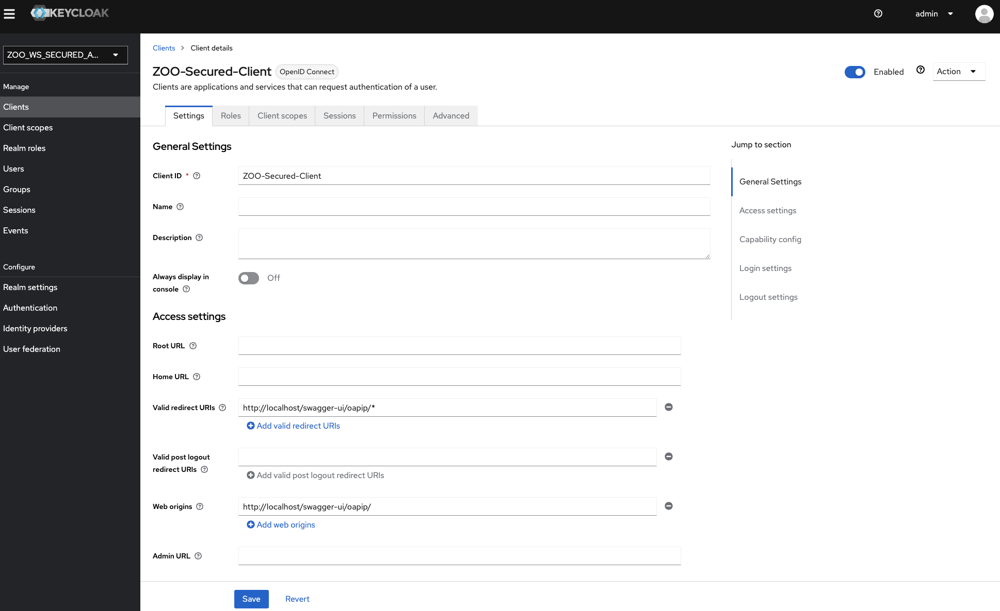
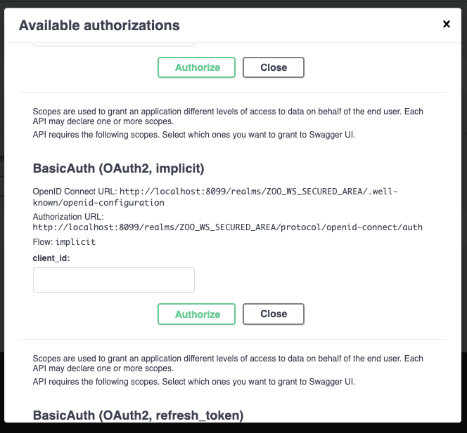

# zoo-workshop-ogc-125-member-meeting
ZOO-Project workshop held during the 125th OGC members meeting in Frascati

## Setup the ZOO-Project using Docker

````
export WS_DIR=~/zoo_ws_ogc
mkdir $WS_DIR
cd $WS_DIR
git clone https://github.com/ZOO-Project/ZOO-Project.git ZPGIT
cd ZPGIT
docker-compose up -d
````
Access your OGC API - Processes - Part 1: Core [landing page](http://localhost/ogc-api/).


## Secure access to specific end-points (using HTTP Basic Authentication)

First, run a shell from the running container.

````
docker exec -it zpgit-zookernel-1 bash
````

From this shell, use the commands below to add an access restriction to the HelloPy execution end-point. The `sed` command adds the path correctly to the list.

````
cat >> /usr/lib/cgi-bin/oas.cfg << EOF
[processes/HelloPy/execution]
length=1
pname=HelloPy
rel=http://www.opengis.net/def/rel/ogc/1.0/execute
method=post
secured=BasicAuth
title=execute a job
abstract=An execute endpoint.
tags=ExecuteEndpoint
tags_description=
schema=http://schemas.opengis.net/ogcapi/processes/part1/1.0/openapi/responses/ExecuteSync.yaml
parameters=/components/parameters/oas-header1
ecode=400,404,500
eschema=http://schemas.opengis.net/ogcapi/processes/part1/1.0/openapi/responses/ExecuteAsync.yaml

[osecurity]
name=BasicAuth
type=http
scheme=basic
realm=Secured section
charset=utf-8
passwd=/tmp/htpasswords

[filter_in]
path=/usr/lib/cgi-bin
service=securityIn

EOF

sed "s#/processes/OTB.BandMath/execution,#/processes/OTB.BandMath/execution,/processes/HelloPy/execution,#g" -i /usr/lib/cgi-bin/oas.cfg
````

Here, we use the default values provided in the official documentation except the `[filter_out]` which won't be used here. 


## Create a password file

First, modify the docker-compose.yaml file (located in `$WS_DIR/ZPGIT`) a bit to add the following volumes to both `zookernel` and `zoofpm`.

````
      - ./docker/security:/etc/zoo-security
````

Then, make sure to restart your containers with the new settings.

````
docker-compose down && docker-compose up -d
````

Now, create the password file with the command below.

````
docker exec zpgit-zookernel-1 htpasswd -c -b /etc/zoo-security/htpasswords test test
````

Now, go back to the [link with rel service-doc](http://localhost/ogc-api/api.html). You should now be able to run the HelloPy service after authenticating using the test/test credentials.



To do so, you can use the following execute request body. 

````
{
    "inputs": {
        "a": "Martin et Jules"
    },
    "outputs": {
        "Result": {
            "transmissionMode": "value"
        }
    }
}
````

By selecting "respond-async;return=representation" for the Prefer header parameter, you should be able to run the service asynchronously.

Please execute the command below to make this example request available from swagger-ui.

````
sed "s#[processes/HelloPy/execution]#[processes/HelloPy/execution]\nexamples=sample.json\nexamples_summary=Simple echo request#g" -i /usr/lib/cgi-bin/oas.fg
````

Then, create and copy the file in the proper location.

````
# Create the file
cat > test.json << EOF
{
    "inputs": {
        "a": "Martin et Jules"
    },
    "outputs": {
        "Result": {
            "transmissionMode": "value"
        }
    }
}
EOF
# Create the target directory
docker exec zpgit-zookernel-1 mkdir /var/www/html/examples/HelloPy
# Copy the file to the right location on the zookernel container
docker cp test.json zpgit-zookernel-1:/var/www/html/examples/HelloPy/sample.json
````

## Using [OpenID Connect 1.0](https://openid.net/connect/) to authenticate

First, you will update the docker-compose.yaml file in the `ZPGIT` directory and add the following content.

````
  keycloack:
    image: quay.io/keycloak/keycloak:20.0.3
    command:
      - start-dev
      - --features admin-fine-grained-authz
    environment:
      KEYCLOAK_ADMIN_PASSWORD: admin
      KEYCLOAK_ADMIN: admin
    ports:
      - "8099:8080"
````

This addition will add a keycloack to your environment, using the default dev setting (start-dev, not production ready).

Once, you have modified the docker-compose.yaml file, run the command below.

````
docker-compose down && docker-compose up -d
````

The keycloack server may take some time to start. After it correctly started, you should be able to access the [keycloack's admin interface](http://localhost:8099/admin/). Please, log in with `admin`/`admin` credential as defined in the `docker-compose.yaml` file.

Using the top left select list, displaying per default "master", you can create a realm. Use `ZOO_WS_SECURED_AREA` for the realm name, and click on create.



Once the realm creation is over, you will add a client with the following Client ID: `ZOO-Secured-Client`. 


On the second configuration page, activate the Implicit flow, then click on save.



In the settings pannel, set the following values (press save to save the settings):

 * *Valid redirect URIs*: `http://localhost/swagger-ui/oapip/*`
 * *Web origins*: `http://localhost/swagger-ui/oapip/`



To conclude the setup, you should decide if you want to use external identity providers (such as GitHub), create a user within keycloack, or both.
If you decide to create a user from keycloack, remember to set a password using the dedicated tab from the User creation form.

You can now edit the `osecurity` section from the `oas.cfg` file to activate the OpenIdConnect option.

````
[osecurity]
name=BasicAuth
type=openIdConnect
openIdConnectUrl=http://localhost:8099/realms/ZOO_WS_SECURED_AREA/.well-known/openid-configuration
````

You will create a `security_service.py` in the `/usr/lib/cgi-bin` directory (of the zookernel container) containing the following Python code snippet

````
import zoo
import jwt
import sys
import json

def securityIn(main_conf,inputs,outputs):
    hasAuth=False
    for i in main_conf["renv"].keys():
        if i.count("HTTP_AUTHORIZATION")>0:
            jsonObj=jwt.decode(main_conf["renv"][i].split(' ')[1], options={"verify_signature": False})
            hasAuth=True
            if "preferred_username" in jsonObj.keys():
                main_conf["auth_env"]={"user": jsonObj["preferred_username"]}
            if "email" in jsonObj.keys():
                main_conf["auth_env"]["email"]=jsonObj["email"]
                
    if "auth_env" in main_conf:
        print(main_conf["auth_env"],file=sys.stderr)
    if hasAuth or main_conf["lenv"]["secured_url"]=="false":
        return zoo.SERVICE_SUCCEEDED
    else:
        if "headers" in main_conf:
            main_conf["headers"]["status"]="403 Forbidden"
        else:
            main_conf["headers"]={"status":"403 Forbidden"}
        main_conf["lenv"]["code"]="NotAllowed"
        main_conf["lenv"]["message"]="Unable to ensure that you are allowed to access the resource."
        return zoo.SERVICE_FAILED
````

Then, you update the `securityIn.zcfg` to have the following parameter values:

 * *serviceType* = Python
 * *serviceProvider* = security_service

You can run the command below from the zookernel container to get this done.

````
sed "s#serviceType = C#serviceType = Python#g;s#serviceProvider = security_service.zo#serviceProvider = security_service#g" -i /usr/lib/cgi-bin/securityIn.zcfg 
````

Note that we decided not to update the name in the `[oosecurity]` section not to require any further updates of other parts of the oas.cfg, such as the `secured` key of the `[processes/HelloPy/execution]` section. In the same way, rather than defining another process name, we kept using `securityIn`.

Now, go back to the [link with rel service-doc](http://localhost/ogc-api/api.html). You should now be able to run the HelloPy service after authenticating using OpenID Connect.



Enter the client id you defined before (`ZOO-Secured-Client`), then press the authenticate button. Your browser should load another page to let you authenticate. Once logged in, you should then come back to the initial page.


## Future steps

Add support for JobID related to execution over secured end-points.

Example: 

 - Paul execute a secured HelloPy asynchronously
 - Paul list the jobs only started by Paul

