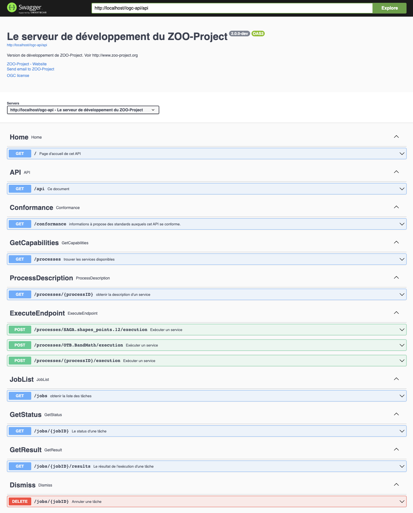
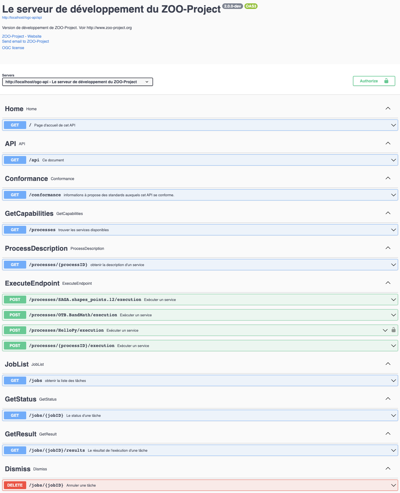

# zoo-workshop-ogc-125-member-meeting
ZOO-Project workshop held during the 125th OGC members meeting in Frascati

## Setup the ZOO-Project using Docker

````
export WS_DIR=~/zoo_ws_ogc
mkdir $WS_DIR
cd $WS_DIR
git clone https://github.com/ZOO-Project/ZOO-Project.git ZPGIT
cd ZPGIT
docker-compose up -d
````
Access your OGC API - Processes - Part 1: Core [landing page](http://localhost/ogc-api/).



## Secure access to specific end-points

First run a shell from the running container.

````
docker exec -it zpgit_zookernel_1 bash
````

From this shell, use the commands below to add an access restriction to the HelloPy execution end-point. The `sed` command is used to add the path properly to the list.

````
cat >> /usr/lib/cgi-bin/oas.cfg << EOF
[processes/HelloPy/execution]
length=1
pname=HelloPy
rel=http://www.opengis.net/def/rel/ogc/1.0/execute
method=post
secured=BasicAuth
title=execute a job
abstract=An execute endpoint.
tags=ExecuteEndpoint
tags_description=
schema=http://schemas.opengis.net/ogcapi/processes/part1/1.0/openapi/responses/ExecuteSync.yaml
parameters=/components/parameters/oas-header1
ecode=400,404,500
eschema=http://schemas.opengis.net/ogcapi/processes/part1/1.0/openapi/responses/ExecuteAsync.yaml

[osecurity]
name=BasicAuth
type=http
scheme=basic
realm=Secured section
charset=utf-8
passwd=/tmp/htpasswords

[filter_in]
path=/usr/lib/cgi-bin
service=securityIn

[filter_out]
path=/usr/lib/cgi-bin
service=securityOut
EOF

sed "s#/processes/OTB.BandMath/execution,#/processes/OTB.BandMath/execution,/processes/HelloPy/execution,#g" -i /usr/lib/cgi-bin/oas.cfg
````

Here, we use the default value provided in the official documentation. Nevertheless, the filter_out is only to illustrate the fact that somethign can be run be fore returning the result to the client application.



## Create a password file

First, modify a bit the docker-compose.yaml file located in `$WS_DIR/ZPGIT` to add the following valumes to both `zookernel` and `zoofpm`.

````
      - ./docker/security:/etc/zoo-security
````

Then, make sure to restart your containers wiht the new settings.

````
docker-compose down && docker-compose up -d
````

Now, create the password file with the command below.

````
docker exec zpgit-zookernel-1 htpasswd -c -b /etc/zoo-security/htpasswords test test
````

Now, go back on the [link with rel service-doc](http://localhost/ogc-api/api.html). You should now be able to run the HelloPy service after authenticating using the test/test credentials.

To do so, you can use the following execute payload. By selecting "respond-async;return=representation" for the Prefer header parameter, you should be able to run the service asynchronously.

````
{
    "inputs": {
        "a": "Martin et Jules"
    },
    "outputs": {
        "Result": {
            "transmissionMode": "value"
        }
    }
}
````

## Using Keycloack to authenticate

## Future steps

